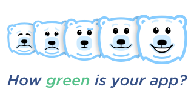

## eco-design SonarQube plugin

There is two kind of plugins :

- One for web (PHP, Python, Java), using smells described in the 2nd edition of the repository published in september 2015
You can find all the rules [here (in french)](https://docs.google.com/spreadsheets/d/1nujR4EnajnR0NSXjvBW3GytOopDyTfvl3eTk2XGLh5Y/edit#gid=1386834576)
- One for mobile (Android), using [a set of smells](https://olegoaer.perso.univ-pau.fr/android-energy-smells/) theorised by Olivier Le Goaër for Android

## How a SonarQube plugin works
Code is parsed to be transformed as AST. AST will allow you to access one or more nodes of your code.
For example, you’ll be able to access of all your `for` loop, to explore content etc.

To better understand AST structure, y a can use [AST Explorer](https://astexplorer.net/)

## Install
Please follow the [installation documentation](INSTALL.md)

## Links
 - https://docs.sonarqube.org/latest/analysis/overview/